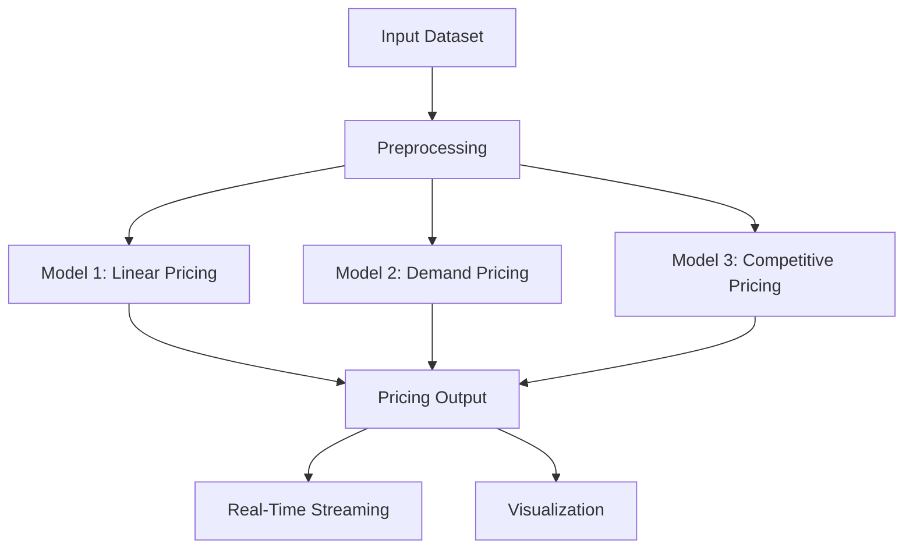

# 🚗 Smart Parking Pricing System – Summer Analytics Project

## 📌 Overview
Dynamic pricing system for parking lots using occupancy, queue, traffic, and vehicle data. Includes real-time simulation and visualization.

## 🧰 Tech Stack
- Python, Pandas, NumPy
- Pathway (real-time streaming)
- Bokeh (visualization)
- Google Colab

## 🏗️ Architecture (Mermaid)

## 🔁 Workflow
1. **Preprocessing**: clean & encode features
2. **Model 1**: Base + occupancy
3. **Model 2**: Weighted demand formula
4. **Model 3**: Price adjusted via nearby lots
5. **Streaming**: Simulated via Pathway
6. **Bokeh**: Live chart of pricing per lot

